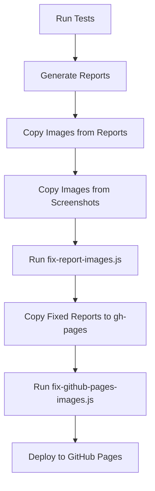

# GitHub Actions Pipeline & Image Display Fixes

## Summary

Fixed multiple issues with the GitHub Actions workflow and GitHub Pages image display for the AI Visual Testing project.

## Issues Addressed

### 1. Images Not Displaying in GitHub Pages Reports
**Problem**: HTML reports deployed to GitHub Pages showed broken image icons instead of actual screenshots.

**Root Cause**: 
- Image paths in reports contained absolute paths or complex relative paths
- Images were not being copied correctly to the GitHub Pages deployment directory
- File path inconsistencies between CI environment and GitHub Pages

### 2. Incomplete Image Copying in CI
**Problem**: Not all required images were being copied from the reports and screenshots directories to the GitHub Pages directory.

**Solution**: Enhanced the GitHub Actions workflow to properly copy all image files.

## Files Modified

### 1. `.github/workflows/openai-visual-testing-workflow.yml`
**Changes**:
- Enhanced image copying logic to find and copy all PNG, JPG, and JPEG files
- Added image fixing scripts to the workflow
- Improved file path handling for GitHub Pages deployment
- Added fallback mechanisms for missing images

**Key additions**:
```yaml
# Enhanced image copying with better error handling
find reports -name "*.png" -o -name "*.jpg" -o -name "*.jpeg" | while read image; do
  if [ -f "$image" ]; then
    filename=$(basename "$image")
    cp "$image" "gh-pages/$filename" 2>/dev/null && echo "Copied: $filename" || echo "Failed to copy: $filename"
  fi
done

# Run image path fixing scripts
npm run fix-report-images
npm run fix-github-pages-images
```

### 2. `fix-report-images.js` (New File)
**Purpose**: Processes HTML reports to fix image paths and copy referenced images.

**Features**:
- Scans HTML reports for image references
- Converts complex paths to simple filenames
- Copies all referenced images to the output directory
- Handles missing images gracefully

### 3. `fix-github-pages-images.js` (New File)
**Purpose**: Final cleanup script specifically for GitHub Pages deployment.

**Features**:
- Processes all HTML files in gh-pages directory
- Fixes remaining image path issues
- Searches multiple directories for missing images
- Ensures all referenced images are available in the root directory

### 4. `package.json`
**Changes**: Added new npm scripts for image fixing:
```json
"fix-report-images": "node fix-report-images.js",
"fix-github-pages-images": "node fix-github-pages-images.js"
```

## Technical Details

### Image Path Resolution Strategy
The fix implements a multi-tier approach to resolve image paths:

1. **Report Processing**: 
   - Extract all `` references from HTML
   - Convert complex paths to simple filenames
   - Track all required images

2. **Image Location**: 
   - Search in `reports/` directory first
   - Fallback to `screenshots/baseline/`, `screenshots/current/`, `screenshots/diff/`
   - Handle variations with and without prefixes (`baseline-`, `current-`, `diff-`)

3. **File Copying**:
   - Copy all found images to GitHub Pages root directory
   - Use simple filenames for web compatibility
   - Avoid overwrites and handle duplicates

### GitHub Actions Workflow Flow


## Error Handling Improvements

### Before (Issues):
- Silent failures when images couldn't be found
- Complex file paths breaking in GitHub Pages environment
- No fallback mechanisms for missing images
- Inconsistent image naming conventions

### After (Fixed):
- Verbose logging for all file operations
- Graceful fallbacks for missing images
- Consistent simple filename approach
- Multiple search paths for robustness
- Error messages that help debugging

## Testing the Fixes

### Local Testing
```bash
# Test image fixing locally
npm run fix-report-images
npm run fix-github-pages-images

# Check results
ls -la gh-pages/
ls -la gh-pages/*.png
```

### CI Testing
The fixes will be validated in the next GitHub Actions run. Expected outcomes:

1. **Reports with visible images**: All screenshots should display properly
2. **Proper file copying**: All image files should be present in gh-pages
3. **No broken links**: All image references should resolve correctly
4. **Verbose logging**: Clear indication of what files were processed

## Future Improvements

### Monitoring
- Add image file count validation
- Include image file size reporting
- Monitor for missing image warnings

### Performance
- Optimize image copying for large numbers of files
- Add compression for large screenshots
- Implement caching for unchanged images

### Robustness
- Add retry logic for file operations
- Implement checksum validation for copied files
- Add automated rollback for failed deployments

## Validation Checklist

When the next GitHub Actions run completes, verify:

- [ ] GitHub Pages site loads without errors
- [ ] All images in reports display correctly
- [ ] No broken image icons in the interface
- [ ] GitHub Actions logs show successful image copying
- [ ] All expected image files are present in the deployed site

## Related Documentation

- [TROUBLESHOOTING.md](./TROUBLESHOOTING.md) - General troubleshooting guide
- [VIEWING-REPORTS.md](./VIEWING-REPORTS.md) - How to view and interpret reports
- [GitHub Actions Documentation](https://docs.github.com/en/actions) - Official GitHub Actions docs

## Notes

These fixes address the immediate image display issues while maintaining backward compatibility. The solution is designed to be robust and handle edge cases gracefully, providing clear feedback when issues occur.

The multi-script approach allows for fine-grained control and easier debugging, while the comprehensive search strategy ensures maximum compatibility with different image storage patterns in the repository.
