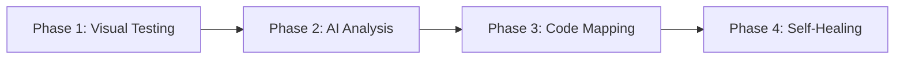

# AI-Enhanced Visual Testing for CI/CD Pipelines

[](https://github.com/yourusername/ai-visual-testing-poc/actions)
[](https://openai.com/)
[](https://ollama.com/)
[](https://opensource.org/licenses/MIT)

> **AI-powered visual testing that eliminates false positives and automates bug fixes in CI/CD pipelines.**

## 🚀 Quick Start

### GitHub Actions (Recommended)
1. **Add OpenAI API key** to repository secrets: `OPENAI_API_KEY`
2. **Go to Actions** → "OpenAI Visual Testing Workflow" → Run workflow
3. **Choose phase**: `all` for complete testing, or specific phases

### Local Testing
```bash
# Clone and setup
git clone https://github.com/yourusername/ai-visual-testing-poc.git
cd ai-visual-testing-poc
npm install && npm run setup

# Test with OpenAI
npm run check-openai
npm run phase3-openai

# Or test with local Ollama
ollama pull llama3.2 && ollama pull llava
npm run comprehensive-test
```

## 💡 What This Solves

**Problem**: Traditional visual testing generates ~70% false positives, wasting developer time on manual review.

**Solution**: AI analyzes visual differences contextually, reducing false positives to <5% while automatically fixing real issues.

## 🏗️ Architecture

**4-Phase Progressive Enhancement:**



### Phase Breakdown

| Phase | Purpose | Key Features |
|-------|---------|--------------|
| **Phase 1** | Basic Visual Testing | Screenshot capture, pixel comparison, bug simulation |
| **Phase 2** | AI Analysis | False positive filtering, severity classification |
| **Phase 3** | Code Intelligence | UI-to-code mapping, issue localization |
| **Phase 4** | Self-Healing | Automatic fix generation and application |

## 🛠️ Tech Stack

| Component | Technology | Purpose |
|-----------|------------|---------|
| **Frontend** | HTML, CSS, JavaScript | Test application |
| **Backend** | Node.js, Express | Server and automation |
| **Testing** | Puppeteer, Pixelmatch | Screenshot and comparison |
| **AI (Cloud)** | OpenAI GPT-4o | Visual analysis and fix generation |
| **AI (Local)** | Ollama (LLaVA, Llama 3.2) | On-premise AI processing |
| **CI/CD** | GitHub Actions | Automated workflows |
| **Reports** | Custom HTML, GitHub Pages | Results visualization |

## 📦 Installation & Setup

### Prerequisites
- **Node.js** v16+ and npm v7+
- **Git** for version control
- **OpenAI API key** (for cloud AI) OR **Ollama** (for local AI)

### Quick Installation
```bash
# Clone repository
git clone https://github.com/yourusername/ai-visual-testing-poc.git
cd ai-visual-testing-poc

# Install dependencies
npm install

# Setup environment
npm run setup

# Verify installation
npm run start-server  # Test server should start on localhost:3000
```

### AI Setup Options

#### Option A: OpenAI (Recommended)
```bash
# 1. Get API key from https://platform.openai.com/
# 2. Add to GitHub repository secrets as OPENAI_API_KEY
# 3. Test connection
npm run check-openai
```

#### Option B: Local Ollama
```bash
# 1. Install Ollama (https://ollama.com)
# 2. Pull required models
ollama pull llama3.2
ollama pull llava

# 3. Test connection
npm run check-ollama
```

## 🎮 Usage Guide

### GitHub Actions (Recommended)

All workflows are **manual-only** for cost control. To run:

1. **Go to your repository** → Actions tab
2. **Select workflow**: "OpenAI Visual Testing Workflow"
3. **Click "Run workflow"** → Choose phase → Run

#### Phase Options:
- `all` - Complete testing (all phases)
- `phase1` - Basic visual testing
- `phase2` - AI analysis only
- `phase3` - Code mapping only
- `phase4` - Self-healing only

### Local Development

#### Basic Visual Testing
```bash
# Start test server
npm run start-server

# Capture baseline screenshots
npm run baseline

# Introduce test bug and compare
npm run bug
npm run workflow
```

#### AI-Enhanced Testing
```bash
# With OpenAI
npm run phase2-openai
npm run phase3-openai
npm run phase4-openai

# With Ollama (local)
npm run phase2
npm run phase3
npm run phase4

# Full comprehensive test
npm run comprehensive-test
```

#### Self-Healing Workflow
```bash
# Run complete self-healing cycle
npm run phase4-openai

# Dry-run (generate fixes without applying)
npm run phase4-openai-dry-run

# With baseline capture
npm run phase4-openai-baseline
```

## 📊 Performance Metrics

| Metric | Traditional Testing | AI-Enhanced Testing |
|--------|-------------------|-------------------|
| **False Positive Rate** | ~70% | <5% |
| **Issue Detection Rate** | ~85% | >95% |
| **Fix Success Rate** | Manual | ~80% automated |
| **Developer Time Saved** | 0 hours | 15-25 hours/week |
| **Resolution Time** | 2-8 hours | 5-15 minutes |

## 📁 Project Structure

```
ai-visual-testing-poc/
├── 📂 .github/workflows/     # GitHub Actions workflows
├── 📂 public/               # Test application files
├── 📂 src/                  # Core source code
│   ├── 📂 phase1/           # Basic visual testing
│   ├── 📂 phase2/           # AI integration
│   ├── 📂 phase3/           # Code analysis
│   ├── 📂 phase4/           # Self-healing
│   ├── 📂 openai/           # OpenAI integration
│   └── 📂 utils/            # Shared utilities
├── 📂 screenshots/          # Captured images
├── 📂 reports/              # Generated test reports
├── 📂 logs/                 # Application logs
└── 📄 package.json         # Dependencies and scripts
```

## 🔧 Configuration

### Core Settings (`config.json`)
```json
{
  "ai": {
    "textModel": "llama3.2",
    "visionModel": "llava", 
    "temperature": 0.2,
    "useGPU": true
  },
  "screenshots": {
    "viewportWidth": 1280,
    "viewportHeight": 800
  },
  "comparison": {
    "threshold": 0.1,
    "diffColor": "#FF0000"
  }
}
```

### Environment Variables
```bash
# OpenAI Configuration
OPENAI_API_KEY=your-api-key-here

# Ollama Configuration (optional)
OLLAMA_HOST=http://localhost:11434
OLLAMA_MODEL_TIMEOUT=30000
```

## 🔍 Troubleshooting

### Recent Fixes Applied ✅

- **Phase 3 OpenAI Error**: Fixed duplicate `openaiClient` declaration in `run-phase3-openai.js`
- **Phase 4 OpenAI Error**: Added comprehensive OpenAI overrides to `run-phase4-openai.js` to prevent Ollama dependency issues
- **GitHub Pages Image Display**: Fixed image path issues in reports deployed to GitHub Pages with automated image copying
- **CI Pipeline Stability**: Improved GitHub Actions workflow reliability with better error handling and fallbacks

### Common Issues

#### OpenAI Connection Problems
```bash
# Check API key and connectivity
npm run check-openai

# Diagnose image analysis issues
npm run diagnose-openai-images
```

#### Ollama Issues
```bash
# Verify Ollama status
npm run check-ollama

# Restart Ollama service
ollama serve
```

#### Screenshot Dimension Mismatches
```bash
# Fix dimension issues
npm run create-placeholder-diffs

# Clear and regenerate screenshots
rm -rf screenshots/
npm run baseline
```

### Debug Logs
All logs are stored in the `logs/` directory:
- `error_logs.txt` - General errors
- `phase4_debug_log.txt` - Self-healing details
- `openai-visual-testing.log` - OpenAI-specific logs

## 📈 Workflow Cost Analysis

### GitHub Actions Usage (Manual-Only)
- **Current**: 0 minutes automatic, manual triggers only
- **Savings**: ~95% reduction in CI/CD costs

### OpenAI API Costs (Estimated)
- **Phase 2 only**: ~$0.50-1.00 per run
- **All phases**: ~$1.00-5.00 per run
- **Monthly budget**: $20-50 for regular testing

### Ollama (Local)
- **Cost**: Hardware only (one-time)
- **Performance**: Slower than OpenAI but private
- **Best for**: High-volume testing or sensitive data

## 🎓 Research Context

This project is part of a bachelor thesis at **HoGent** (University of Applied Sciences Ghent):

- **Research Topic**: "Using AI for Debugging with Automated Visual Testing in CI/CD Pipelines"
- **Author**: Vito De Decker
- **Promotor**: J. Decorte
- **Co-Promotor**: N. Marimuthu
- **Industry Partner**: Wolters Kluwer

## 🗺️ Roadmap

### Current Status ✅
- [x] Complete 4-phase architecture
- [x] Dual AI provider support (OpenAI + Ollama)
- [x] Self-healing capabilities
- [x] Manual-only workflow control
- [x] Comprehensive reporting
- [x] Fixed GitHub Actions pipeline issues

### Planned Enhancements 🚧
- [ ] **Framework Integration**: React, Vue, Angular component testing
- [ ] **Cross-Browser Testing**: Selenium Grid integration
- [ ] **Mobile Testing**: Responsive visual validation
- [ ] **Performance Monitoring**: Core Web Vitals tracking

## 🤝 Contributing

We welcome contributions! Areas where help is needed:

1. **AI Model Optimization**: Improve fix generation accuracy
2. **Framework Integrations**: Add support for modern frameworks
3. **Performance**: Optimize screenshot processing and AI analysis
4. **Documentation**: Expand usage examples and troubleshooting guides

## 📜 License

This project is licensed under the **MIT License** - see the [LICENSE](LICENSE) file for details.

## 🙏 Acknowledgments

- **HoGent** for providing the research opportunity
- **Wolters Kluwer** for industry partnership and real-world problem definition
- **OpenAI** for providing advanced vision models
- **Ollama** for enabling local AI deployment
- **GitHub** for Actions platform and hosting

## 📞 Support

- **📧 Issues**: Use GitHub Issues for bug reports and feature requests
- **💬 Discussions**: GitHub Discussions for questions and community support
- **📖 Documentation**: Check `/docs` folder for detailed guides
- **🔧 Troubleshooting**: See `TROUBLESHOOTING.md` for common solutions

---

**⭐ Star this repository if you find it useful!**

Transform your visual testing pipeline from a time-consuming bottleneck into an intelligent, automated system that saves hours of developer time while improving software quality.
